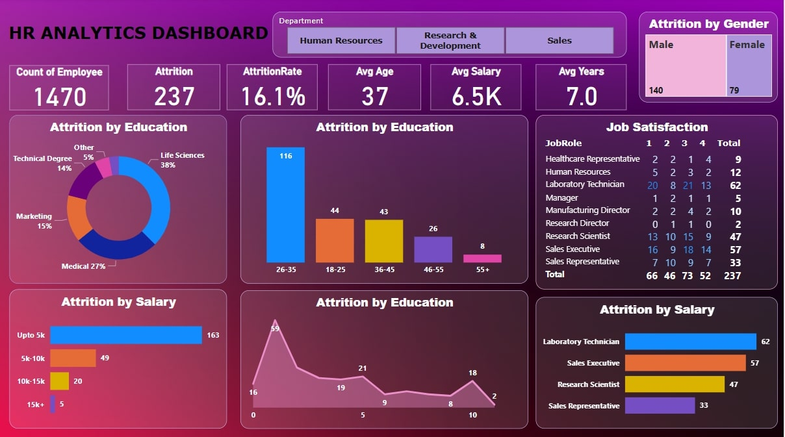

# HR Analytics Dashboard 📊📈

Welcome to the **HR Analytics Dashboard**, a dynamic tool that brings key insights into employee attrition, salary distribution, education background, job satisfaction, and more! This dashboard provides an overview of essential HR metrics, designed to help you make informed decisions about employee retention, department performance, and overall company health.

## Table of Contents 📚
- [Overview](#overview)
- [Key Metrics](#key-metrics)
- [Dashboard Features](#dashboard-features)
- [Visualizations Breakdown](#visualizations-breakdown)
- [How to Use](#how-to-use)
- [Insights & Suggestions](#insights--suggestions)
- [Conclusion](#conclusion)

---

## Overview 👀

The **HR Analytics Dashboard** is powered by PowerBI, offering interactive and detailed insights into various HR metrics. The dashboard covers employee demographics, attrition rates, salary breakdowns, and satisfaction levels across departments. It is designed to assist HR and management teams in understanding trends and making data-driven decisions regarding workforce management. 

Key Features:
- Real-time employee attrition rate 🔍
- Attrition by department, education level, and salary 📊
- Employee satisfaction by job role 💼
- Department-wise comparisons and visual trends

---

## Key Metrics 🔑

- **Total Employees**: 1,470  
- **Employee Attrition**: 237 (16.1% attrition rate)  
- **Average Employee Age**: 37  
- **Average Salary**: 6.5K  
- **Average Tenure**: 7 years  
- **Gender Breakdown**:  
  - Male: 140  
  - Female: 79  

These core metrics provide a high-level view of the workforce composition and attrition trends, making it easier for HR teams to spot potential issues or areas of improvement.

---

## Dashboard Features 🌟

1. **Department Filter** 🔄
   - View insights by departments like **Human Resources**, **Research & Development**, and **Sales**. Filter your analysis based on the department of your choice.

2. **Attrition Rate** 📉
   - Get a quick look at the overall attrition rate across all departments and individual breakouts.

3. **Attrition by Education** 🎓
   - Dive deeper into attrition trends based on the **education level** of employees. Categories include **Life Sciences**, **Medical**, **Technical Degree**, and **Marketing**.

4. **Attrition by Gender** 🚻
   - Visualize attrition trends split between **Male** and **Female** employees. 

5. **Attrition by Salary** 💰
   - Breakdown of attrition rates across different salary ranges:  
     - **Up to 5K**  
     - **5K-10K**  
     - **10K-15K**  
     - **15K+**

6. **Job Satisfaction** 😌  
   - Visualize job satisfaction levels for different roles (1 = Low, 4 = High, 5 = Very High). This is great for understanding the connection between satisfaction and attrition.

7. **Role-Specific Insights** 🔍
   - Analyze the satisfaction scores and attrition rates for specific job roles like **Healthcare Representatives**, **Sales Executives**, **Laboratory Technicians**, and more.

---

## Visualizations Breakdown 🔎

### 1. **Attrition by Education 🎓**  
This chart visualizes the breakdown of attrition based on the education background of employees:
- **Life Sciences**: 38%
- **Medical**: 27%
- **Marketing**: 15%
- **Technical Degree**: 14%
- **Other**: 5%

### 2. **Attrition by Age Group 🧑‍🦳**  
The bar chart compares attrition rates across various age groups:
- **26-35**: 116 employees  
- **18-25**: 44 employees  
- **36-45**: 43 employees  
- **46-55**: 26 employees  
- **55+**: 8 employees

### 3. **Attrition by Salary 💵**  
Attrition is also segmented by salary range:
- **Up to 5K**: 163 employees  
- **5K-10K**: 49 employees  
- **10K-15K**: 20 employees  
- **15K+**: 5 employees

### 4. **Job Satisfaction by Role 😀**  
This section provides a breakdown of job satisfaction levels (1-5) across different job roles:
- **Healthcare Representative**: Total satisfaction score: 9  
- **HR**: Total satisfaction score: 12  
- **Laboratory Technician**: Total satisfaction score: 62  
- **Manager**: Total satisfaction score: 5  
- **Sales Executive**: Total satisfaction score: 57

This gives a deeper understanding of how satisfied employees are across different departments and job roles.

---

## How to Use 🔧

1. **Select Department**: Use the department filter at the top to view metrics for specific departments like HR, Sales, or Research & Development.
2. **Hover Over Charts**: Hovering over any visual element (bar, pie chart, etc.) will give you detailed data points for deeper analysis.
3. **Job Satisfaction Insight**: Check out the **Job Satisfaction by Role** section to identify areas for improvement in specific job functions. This can help guide decisions about employee engagement and retention.
4. **Attrition Analysis**: Pay close attention to the **Attrition by Education** and **Attrition by Salary** visualizations to see where attrition is more prominent, helping guide recruitment and retention strategies.

---

## Insights & Suggestions for Business Growth 🚀

### 1. **Targeting High Attrition Groups** 🎯
   - **Age Group**: The age group **26-35** has the highest attrition rate (116 employees). This could indicate that mid-career professionals may be leaving in search of new opportunities or due to job dissatisfaction. Consider offering more career growth opportunities, training programs, and mentorship for this age group.
   - **Salary and Compensation**: A significant number of employees with a salary of **Up to 5K** (163 employees) are leaving. Evaluate salary structures and benefits to ensure they are competitive within the industry. Offering attractive compensation packages could help in retaining top talent in this group.

### 2. **Improving Employee Satisfaction** 😌
   - **Laboratory Technicians** have a high satisfaction score (62) but still experience attrition. The company should explore ways to further improve job satisfaction for this role, such as providing more career progression paths, better working conditions, and reward systems for retention.
   - The **Healthcare Representative** and **Sales Representative** roles show lower satisfaction levels. Look into employee engagement initiatives, such as regular feedback sessions, incentive programs, and team-building activities, to improve morale and reduce turnover.

### 3. **Upskilling & Education Programs** 📚
   - Employees with **Life Sciences** and **Medical** education have the highest attrition rate. Developing specialized training and career development programs could help retain employees who feel that their skills and knowledge are underutilized. Offering growth opportunities through education could reduce turnover in these segments.
   
### 4. **Gender Diversity & Inclusion** 🏳️‍🌈
   - The **Attrition by Gender** section shows a higher number of male employees leaving (140 male vs 79 female). Review your gender diversity and inclusion policies to ensure equal opportunities for growth and leadership positions, and to identify any underlying causes for higher attrition among male employees.

### 5. **Improve Retention with Tailored Benefits** 💼
   - Employees in roles like **Sales Executive** and **Research Scientist** might benefit from performance-based incentives or bonus structures. Tailoring benefits based on role-specific needs can improve job satisfaction and retention.
   
### 6. **Department-Specific Strategies** 📅
   - **Sales** department shows relatively high attrition, which might point to a stressful environment or unmet targets. Consider reviewing sales targets and offering incentives that encourage a healthier work-life balance. Addressing this could help improve employee retention in this department.
   - **Research & Development** employees seem to have better retention, but continual investment in innovation and support for these employees could maintain or even improve retention over time.

---

## Conclusion 🎯

The **HR Analytics Dashboard** is your go-to tool for tracking key HR metrics, visualizing trends, and making data-driven decisions. Whether you're evaluating employee attrition, understanding the salary distribution, or monitoring job satisfaction across roles, this dashboard has everything you need to ensure your organization is on the path to success!

✨ **Key Benefits**:
- Actionable insights for HR teams
- Clear visualizations for understanding employee trends
- Helps optimize retention strategies
- Tracks employee satisfaction and attrition over time

Let data drive your decisions! 🚀

---

### 💬 **Feedback and Suggestions**
If you have any feedback or would like to see more features in the future, feel free to reach out! 😊
